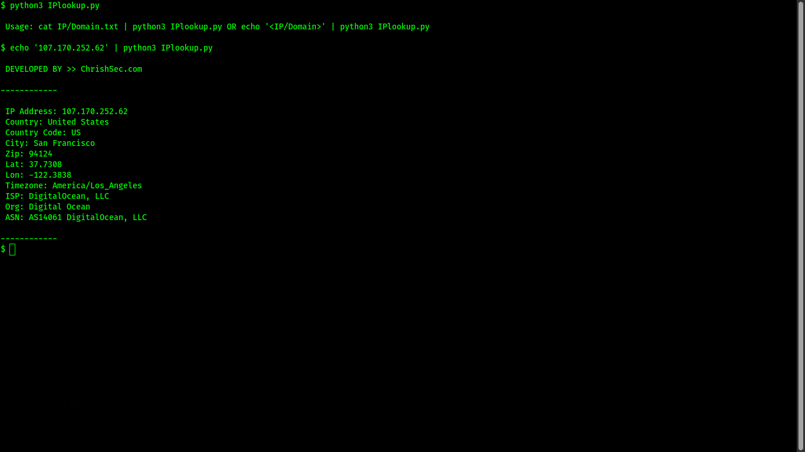

## IPlookup

`IPlookup` allows you to perform IP/Domain lookup using the [iplookup.chrishsec.com](https://iplookup.chrishsec.com) API.

### Requirements
- Python 3.x
- Unix-like operating system (tested on Ubuntu 20.04)

### Usage

1. Clone the repository:

```git clone https://github.com/ChrishSec/IPlookup.git```

2. Install the required dependencies:

```pip3 install -r requirements.txt```

3. Run the IPlookup.py:

```python3 IPlookup.py```

### Screenshots




## Disclaimer

This tool is intended for educational and research purposes only. Use it at your own risk. The author is not responsible for any damage caused by the use or misuse of this tool.

## License

This tool is released under the GNU General Public License v3.0. Everyone is permitted to copy and distribute verbatim copies of this license document, but changing it is not allowed.

## Author

This tool was developed by [ChrishSec](https://github.com/ChrishSec). Feel free to fork, modify, and distribute it. If you have any questions or suggestions, please reach out to the author on [Telegram](https://t.me/ChrishSec).

